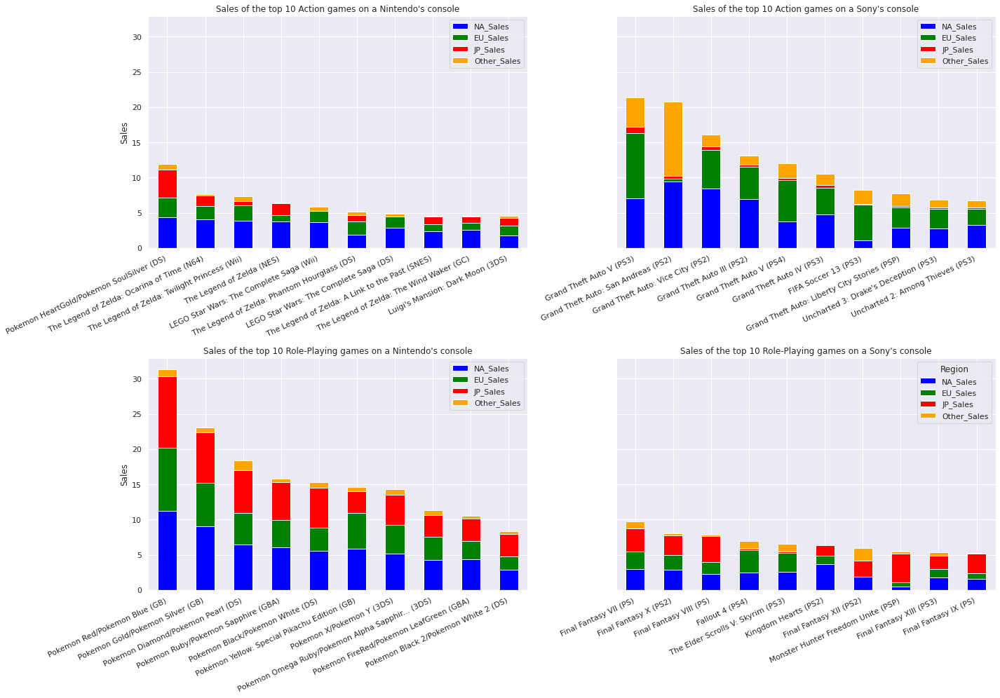
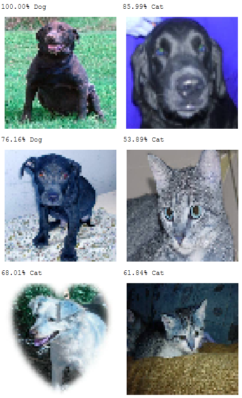
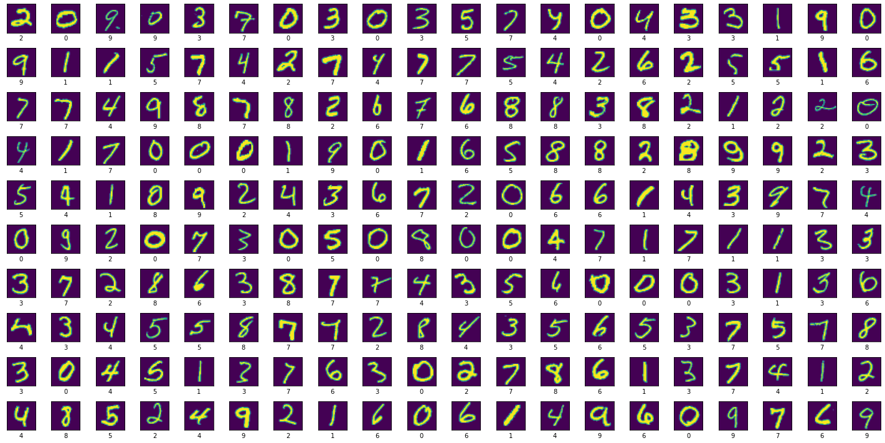

# Kaggle - Machine Learning and Data Science Community
A backup from all my codes on Kaggle

## [Games and Consoles - Data Visualization](https://github.com/JaimePazLopes/Kaggle-Machine-Learning-and-Data-Science-Community/blob/master/filter-and-plot-of-game-data.ipynb)

## [Cats and Dogs - Image Classification](https://github.com/JaimePazLopes/Kaggle-Machine-Learning-and-Data-Science-Community/blob/master/cats-and-dogs.ipynb)

## [Digit Recognizer](https://github.com/JaimePazLopes/Kaggle-Machine-Learning-and-Data-Science-Community/blob/master/digit-recognizer.ipynb)

